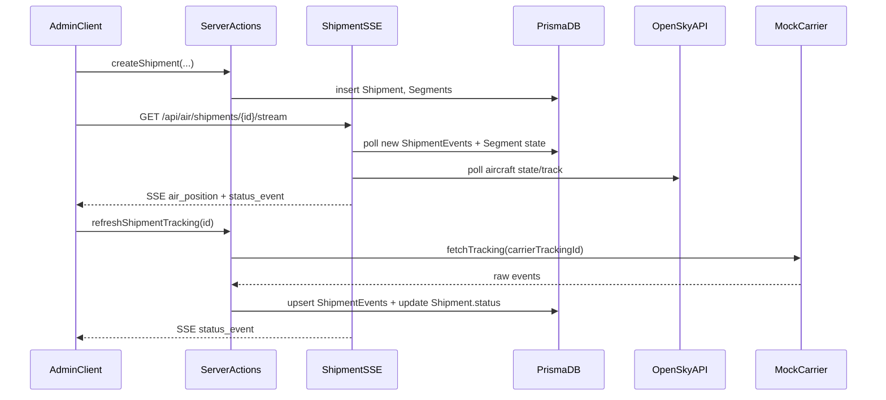

# Airline Orders + Live Hybrid Tracking (Prototype)

## Goals

- Add a new **Air Shipments** module to the existing admin dashboard to **create/manage air orders**, view **hybrid tracking** (pickup ground segment, air segment, last-mile ground segment), and see **live updates**.
- Use **OpenSky** to show an aircraft on the map for the air leg (prototype). Use a **custom carrier connector framework** with a **MockCarrier** implementation to demonstrate shipment tracking API integrations.
- Keep pages **client-side** and do all data access via **server functions** (server actions / route handlers), strictly TypeScript, modular components.

## Non-Goals (for prototype)

- No public customer tracking page (dashboard-only for now).
- No production-grade carrier onboarding portal (we’ll provide a clean connector framework + one mock connector + an OpenSky connector).

## High-Level Architecture

### Domain model

We will introduce a new top-level entity `Shipment` (air order) that can have multiple `Segments`:

- `GroundSegment` references existing `Job` (already supports live driver tracking via `DriverLocation` + SSE).
- `AirSegment` stores flight metadata and is tracked via:
- **Aircraft position** from OpenSky ([OpenSky REST API docs](https://openskynetwork.github.io/opensky-api/rest.html))
- **Shipment status events** from a carrier connector (prototype: MockCarrier)

### Realtime

We’ll reuse the existing SSE approach (currently `app/api/driver/location/[jobId]/stream/route.ts` polls DB and emits SSE events) and add:

- `GET /api/air/shipments/[shipmentId]/stream `→ SSE events `status_event`, `air_position`, `segment_state`, `completed`.
- For prototype reliability, the SSE route will poll:
- DB for latest shipment events/segment states
- OpenSky for aircraft state/track at a safe interval

### Connectors

Add a small connector interface:

- `CarrierConnector` with methods like `fetchTracking(trackingId)` and `normalizeEvents(...)`.
- Implementations:
- `MockCarrierConnector` (deterministic fake timeline + optional manual “push event” server action)
- `OpenSkyConnector` (fetch aircraft state vectors / track)

OpenSky endpoints we will use (server-side only):

- `GET /states/all` (to fetch state vectors; rate limited) and/or `GET /tracks` for trajectory ([OpenSky REST API docs](https://openskynetwork.github.io/opensky-api/rest.html)).

## UI/UX (Dashboard)

### New section

- Add a dashboard nav entry: **Air Shipments**.

### Pages (client)

- `app/dashboard/air-shipments/page.tsx` (client)
- Table/list with filters: status, carrier, date, airport pair.
- Create shipment CTA.
- `app/dashboard/air-shipments/new/page.tsx` (client)
- Create form (strict validation) and optional linking of:
    - pickup `Job` (existing)
    - air segment (carrierTrackingId + flight meta)
    - drop `Job`
- `app/dashboard/air-shipments/[shipmentId]/page.tsx` (client)
- Split layout similar to existing tracking UI:
    - left: shipment details + timeline
    - right: map
- Map layers:
    - Ground: reuse existing map styles/components from `app/dashboard/track/_components/*` where possible.
    - Air: draw airport-to-airport great-circle/line + aircraft marker updated live.

### Reuse existing patterns

- Reuse the overall layout components: `AppSidebar`, `SiteHeader`, `SidebarProvider`.
- Reuse the “live” indicator pattern from `app/dashboard/track/_hooks/useDriverLocation.ts` but create a new hook for shipment SSE.

## Data Model (Prisma)

Add new models to `prisma/schema.prisma`:

- `Shipment` (id, referenceCode, status, createdAt, updatedAt, metadata)
- `ShipmentSegment` (id, shipmentId, type enum: `ground_pickup|air|ground_drop`, ordering)
- For ground segments: `jobId` optional FK to `Job`
- For air segment: `carrier`, `carrierTrackingId`, `flightNumber`, `fromAirportIcao`, `toAirportIcao`, `icao24` (optional for prototype; can be set once known), times
- `ShipmentEvent` (id, shipmentId, segmentId?, type enum, title, description, location fields, occurredAt, raw Json)
- (Optional for prototype, recommended): `AirPositionPoint` (shipmentId/segmentId, lat/lng/alt/heading/velocity, timestamp) for caching + replay.

We will also add enums for shipment status and segment type.

## Server Functions / API Surface

### Server actions (preferred for dashboard data)

Create a small `app/dashboard/air-shipments/_server/*` module set:

- `listShipments(filters)`
- `getShipmentDetail(shipmentId)`
- `createShipment(input)`
- `linkJobToSegment(...)`
- `appendManualEvent(...)` (for demo)

### Route handlers

- `GET /api/air/shipments/[shipmentId]/stream`
- SSE polling loop
- emits:
    - `connected`
    - `status_event` (new events)
    - `air_position` (latest aircraft pos)
    - `completed` (terminal states)

### Carrier integration prototype

- `app/lib/carriers/types.ts` + `app/lib/carriers/mock.ts`
- A `refreshShipmentTracking(shipmentId)` server action that:
- calls connector
- stores normalized `ShipmentEvent` rows
- updates `Shipment.status`

## Security / Permissions

- Dashboard routes require existing admin session checks (reuse existing admin auth utilities in `app/api/_utils/admin-session.ts` patterns).
- SSE route will validate admin session.

## Implementation Steps

1. **Schema + migrations**: add `Shipment*` models and relations; generate migration.
2. **Connector framework**: implement `CarrierConnector` + `MockCarrierConnector` + `OpenSkyConnector` (server-only).
3. **Server actions**: CRUD + tracking refresh + event normalization.
4. **SSE streaming**: shipment live stream endpoint mirroring the existing driver SSE approach.
5. **Dashboard UI**: list + create + detail/tracking page; map/timeline components; live indicator.
6. **Demo data flow**: a “Simulate update” control on the shipment detail page that triggers `refreshShipmentTracking` and shows live updates.

## Key Files to Add/Change

- `prisma/schema.prisma`
- `app/dashboard/air-shipments/**`
- `app/dashboard/air-shipments/_server/**`
- `app/api/air/shipments/[shipmentId]/stream/route.ts`
- `lib/carriers/**` (new)
- Potential small nav update in `components/dashboard/nav-main.tsx` (or wherever dashboard nav is composed)

## Data Flow Diagram (Realtime)

## Sensible Prototype Defaults (unless you change them)